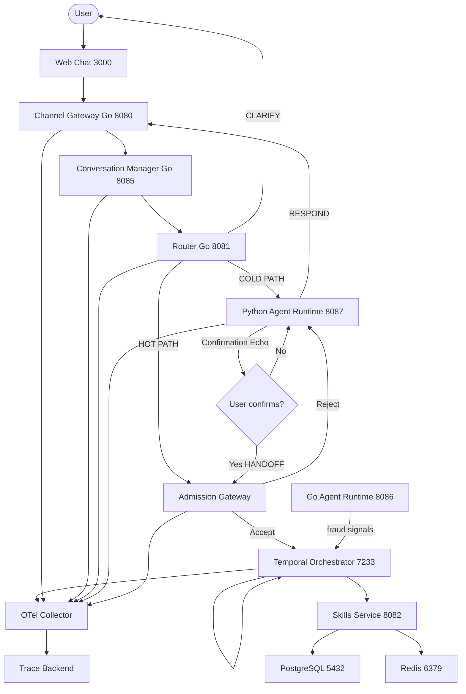

```mermaid
flowchart TD
    User([User]) --> WebChat[Web Chat 3000]
    WebChat --> GW[Channel Gateway Go 8080]
    GW --> CM[Conversation Manager Go 8085]
    CM --> Router[Router Go 8081]
    Router -->|COLD PATH| PA[Python Agent Runtime 8087]
    Router -->|HOT PATH| AG[Admission Gateway]
    Router -->|CLARIFY| User
    PA -->|Confirmation Echo| Confirm{User confirms?}
    Confirm -->|No| PA
    Confirm -->|Yes HANDOFF| AG
    PA -->|RESPOND| GW
    AG -->|Reject| PA
    AG -->|Accept| TW[Temporal Orchestrator 7233]
    TW --> TW
    GAR[Go Agent Runtime 8086] -->|fraud signals| TW
    TW --> Skills[Skills Service 8082]
    Skills --> Redis[Redis 6379]
    Skills --> PG[PostgreSQL 5432]
    TW --> OTEL[OTel Collector]
    GW --> OTEL
    CM --> OTEL
    Router --> OTEL
    PA --> OTEL
    AG --> OTEL
    OTEL --> Backend[Trace Backend]
```
