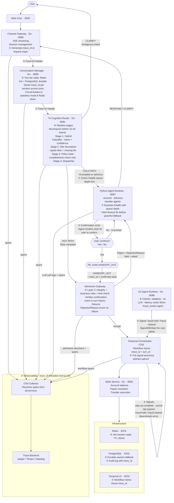

```mermaid


flowchart TD
    User([User]) --> WebChat["Web Chat · :3000"]
    WebChat --> GW

    GW["Channel Gateway · Go · :8080
    SSE streaming · Session management
    ① Generates trace_id at request origin"]

    GW -->|"X-Trace-ID header"| CM

    CM["Conversation Manager · Go · :8085
    ④ Two-tier state: Redis hot + PostgreSQL durable
    Stores trace_id per session across turns
    Circuit-breaks to stateless mode if Redis down"]

    CM -->|"X-Trace-ID header"| Router

    Router["Tri-Cognitive Router · Go · :8081
    ⑥ Pipeline stages decompose before 15-20 intents
    Stage 1: Hybrid Classifier - intent + confidence
    Stage 2: Slot Normalizer - typed slots + missing list
    Stage 3: Policy Gate - completeness check only
    Stage 4: Dispatcher"]

    Router -->|"COLD PATH
    Incomplete or advisory
    ⑦ Check /health queue depth first"| PA

    Router -->|"HOT PATH
    Slots complete"| AG

    Router -->|"CLARIFY
    Ambiguous intent"| User

    PA["Python Agent Runtime · :8087
    account · advisory · transfer agents
    ⑦ Exposes /health with queue depth
    Hard timeout 8s before graceful fallback"]

    PA -->|"RESPOND / CLARIFY"| GW

    PA -->|"① Confirmation echo
    Agent renders slots for user to confirm"| ConfirmStep

    ConfirmStep{{"User confirms?
    Yes / No"}}

    ConfirmStep -->|"No - re-prompt"| PA
    ConfirmStep -->|"Yes"| PA2

    PA2(["PA: emits HANDOFF_HOT"])

    PA2 -->|"HANDOFF_HOT
    + trace_id + confirmed slots"| AG

    AG["Admission Gateway
    ② Layer 2: Integrity + business rules + limit check
    Verifies confirmation event in turn history
    Returns RejectionReason enum on failure"]

    AG -->|"Reject + RejectionReason
    field + detail"| PA

    AG -->|Accept| TW

    TW["Temporal Orchestrator · :7233
    Workflow memo: trace_id + turn_id
    ⑤ Full signal taxonomy defined upfront"]

    TW -->|"⑤ Signals
    step-up-complete · cancel
    otp-expired
    fraud-hold / fraud-cleared
    downstream-error"| TW

    GAR["Go Agent Runtime · Go · :8086
    ⑧ Charter: stateless · no LLM · latency under 50ms
    fraud_review agent"]

    GAR -->|"⑤ Signal: fraud-hold / fraud-cleared
    SignalWithStart for race safety"| TW

    TW --> Skills["Skills Service · Go · :8082
    Account balance · Payee resolution
    Transfer execution"]

    Skills --> Infra

    subgraph Infra["Infrastructure"]
        Redis["Redis · :6379
        ④ Hot session state · TTL 30min"]
        PG["PostgreSQL · :5432
        ④ Durable session fallback
        ③ Audit log with trace_id"]
        TemporalUI["Temporal UI · :8233
        ③ Workflow memo shows trace_id"]
    end

    subgraph Observability["③ Observability - trace_id threaded end-to-end"]
        OTEL["OTel Collector
        Receives spans from all services"]
        Backend["Trace Backend
        Jaeger / Tempo / Datadog"]
    end

    GW -->|"spans"| OTEL
    CM -->|"spans"| OTEL
    Router -->|"spans"| OTEL
    PA -->|"LLM call logs + spans"| OTEL
    AG -->|"admission decisions + spans"| OTEL
    TW -->|"workflow spans"| OTEL
    OTEL --> Backend
```
