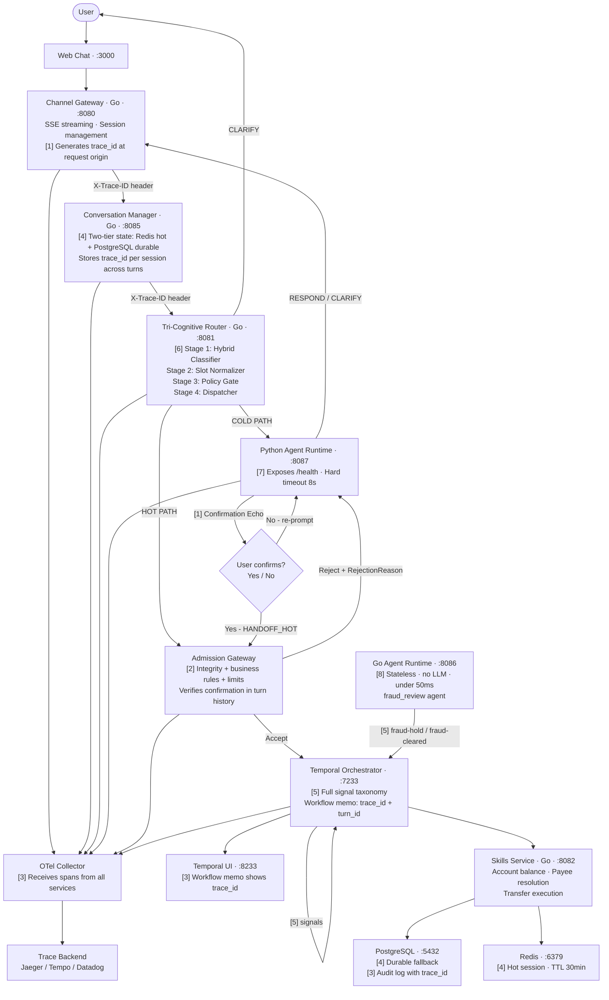

```mermaid
flowchart TD
    User([User]) --> WebChat["Web Chat · :3000"]
    WebChat --> GW["Channel Gateway · Go · :8080\nSSE streaming · Session management\n[1] Generates trace_id at request origin"]
    GW -->|"X-Trace-ID header"| CM["Conversation Manager · Go · :8085\n[4] Two-tier state: Redis hot + PostgreSQL durable\nStores trace_id per session across turns"]
    CM -->|"X-Trace-ID header"| Router["Tri-Cognitive Router · Go · :8081\n[6] Stage 1: Hybrid Classifier\nStage 2: Slot Normalizer\nStage 3: Policy Gate\nStage 4: Dispatcher"]
    Router -->|"COLD PATH"| PA["Python Agent Runtime · :8087\n[7] Exposes /health · Hard timeout 8s"]
    Router -->|"HOT PATH"| AG["Admission Gateway\n[2] Integrity + business rules + limits\nVerifies confirmation in turn history"]
    Router -->|"CLARIFY"| User
    PA -->|"[1] Confirmation Echo"| Confirm{"User confirms?\nYes / No"}
    Confirm -->|"No - re-prompt"| PA
    Confirm -->|"Yes - HANDOFF_HOT"| AG
    PA -->|"RESPOND / CLARIFY"| GW
    AG -->|"Reject + RejectionReason"| PA
    AG -->|"Accept"| TW["Temporal Orchestrator · :7233\n[5] Full signal taxonomy\nWorkflow memo: trace_id + turn_id"]
    TW -->|"[5] signals"| TW
    GAR["Go Agent Runtime · :8086\n[8] Stateless · no LLM · under 50ms\nfraud_review agent"] -->|"[5] fraud-hold / fraud-cleared"| TW
    TW --> Skills["Skills Service · Go · :8082\nAccount balance · Payee resolution\nTransfer execution"]
    Skills --> Redis["Redis · :6379\n[4] Hot session · TTL 30min"]
    Skills --> PG["PostgreSQL · :5432\n[4] Durable fallback\n[3] Audit log with trace_id"]
    TW --> TUI["Temporal UI · :8233\n[3] Workflow memo shows trace_id"]
    GW --> OTEL["OTel Collector\n[3] Receives spans from all services"]
    CM --> OTEL
    Router --> OTEL
    PA --> OTEL
    AG --> OTEL
    TW --> OTEL
    OTEL --> Backend["Trace Backend\nJaeger / Tempo / Datadog"]
```
